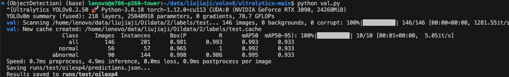

## 命令
```bash
export WANDB_MODE=disabled  # 禁止使用，不然会报错

nohup python train.py > /home/lenovo/data/liujiaji/powerGit/OilGit/logs/oildata-yolov8m-coordAtt.log 2>&1 & tail -f /home/lenovo/data/liujiaji/powerGit/OilGit/logs/oildata-yolov8m-coordAtt.log

python detect.py > /home/lenovo/data/liujiaji/powerGit/OilGit/logs/detect/DJI_20240926150333_0001_Z.log 2>&1 & tail -f /home/lenovo/data/liujiaji/powerGit/OilGit/logs/detect/DJI_20240926150333_0001_Z.log

scp -r lenovo@121.195.169.36:/home/lenovo/data/liujiaji/yolov8/ultralytics-main/runs/detect/multi/conf-0.85/oilexp9/DJI_20240926150333_0001_Z.avi /Users/rl/Desktop/

```

#### 实验

```text
数据集：
well normal 数量为: 89 89 
well lost 数量为: 80 80 
well with man:car 数量为: 86 86 
warning-stacks 数量为: 328 328 
Pointer abnormal 数量为: 31 31 
Pointer normal 数量为: 115 115 

所有文件数量为: 729 729
train set size: 510 val set size: 73 test set size: 146
```


``` bash
[0-Well lost,1-Well with man,2-Well with car, 
3-Warning-Stacks damaged,4-Warning-Stacks with man,5-Warning-Stacks with car,6-Pointer abnormal,
7-normal]

# + randomfog\snow\rain
epoch = 200, runs/oilexp2: yolov8m.yaml
epoch = 200, runs/oilexp3: yolov8m-bifpn.yaml 

# + + randomfog\snow\rain\copy_paste\mixup
## copy_paste=1.0 ，mixup=1.0
epoch = 200, runs/oilexp4: yolov8m.yaml   
## mosaic=0.5，copy_paste=0.5 ，mixup=0.5
epoch = 200, runs/oilexp5: yolov8m.yaml   

# copy_paste=0.5 CoordAtt
epoch = 300, runs/oilexp6: yolov8m-attention.yaml  

```


------------ 二分类 ----------

``` bash
[0-normal,1-abnormal]

epoch = 200, runs/oilexp: yolov8m.yaml 
test数据集结果如下图：
```



